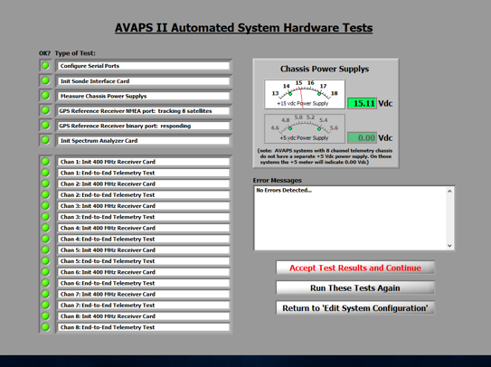
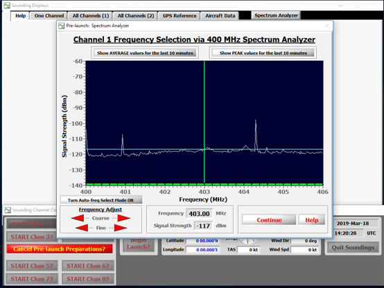
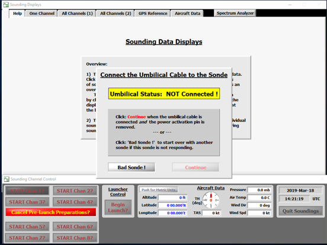
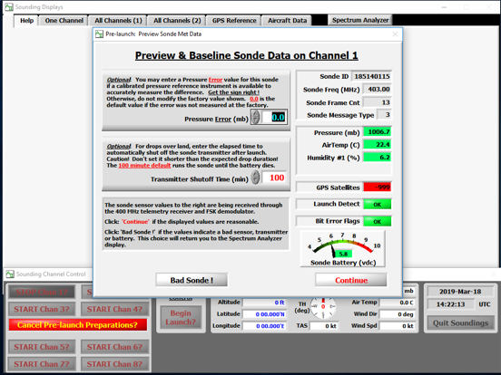
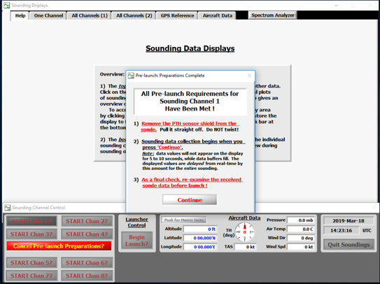

# In-flight Operations

Once the [pre-flight operations](./pre_flight.md) are complete and the tests are successful (or relevant workarounds have been achieved), we are ready for the in-flight operations. These consist primarily of initialization and launch.

## Initialization

1. Start the AVAPS software as explained in [Switching on AVAPS](./switching_on.md). Continue by clicking on `Soundings`.

2. Set Project Name (name of the campaign) and Mission ID (in the format of `YYYYMMDD`}. Then, click on `Save and Continue`.

3. The software will now start running tests. Wait till all tests are run. If all tests are successful (all green), click `Accept Test Results and Continue`. If there is an unsuccessful test, go to the Troubleshooting section. An all-successful run of tests will look at the end like the image below.

    |  |
    | :----------------------------------------------------: |
    |                   *All tests green*                    |


4. Select an unused channel by clicking the `Start_Chan_X` button

5. The frequency-analyzer for the selected channel will start. Now choose an unused frequency you intend to use for this sonde. Set the frequency by moving the green line with the mouse or use the red cursors, then click `Continue`.

    |  |
    | :----------------------------------------------------------: |
    |                     *Frequency analyzer*                     |

6. Now connect the sonde with the data interface cable (find it in the initialization rack as shown in the HRDS rack photo in the [Switching On section](switching_on.md)) and unplug the power inhibitor of the sonde (red power pin).

    |  |
    | :--------------------------------------------------------: |
    |                    *Connect umbilical*                     |

 7. As soon as the system detects the connection, the yellow warning will disapear and the display should show actual data values of measured properties. The GPS values usually take longer to start coming in. All measurement values should be showing (i.e. green everywhere). If any of them are red, mark this sonde as `Bad Sonde` both in the software as well as physically on the sonde with a thick-nib pen (Sharpie?), and keep it aside. Start with a different sonde.

    |  |
    | :----------------------------------------------------------: |
    |                     *Preview sonde data*                     |

 8. If AVAPS is connected to aircraft data (which it should be during flight operations), the meteorological data from the aircraft is taken in automatically.

 9. The dropsonde is now ready. Prepare the sonde for launching. First, disconnect the data cable and put the sonde in the re-conditioning-box. Click on `Continue`.

    |  |
    | :--------------------------------------------: |
    |                 *Sonde ready*                  |


## Launch

```{warning}
The following sequence of steps are like a checklist for launching sondes, and not designed as a complete tutorial for a beginner. It is best to get practice with the launch operations on board with another experienced operator. Ideally, this is done mid-flight, but could also be learnt on ground, although the lack of pressure-difference between the cabin and the environment makes a big difference in how the launch is experienced by the operator.
```

1.  Power on the dispenser unit
2.	Remove carefully the red cover of the dropsonde-sensor
3.	Remove tape from the black delayed deployment mechanism
4.	Open the dispenser
5.	Place the sonde sensors down in the launcher tube
6.	Close the dispenser
7.	Open release valve
8.	Check if sonde left the dispenser
9.	Close release valve
