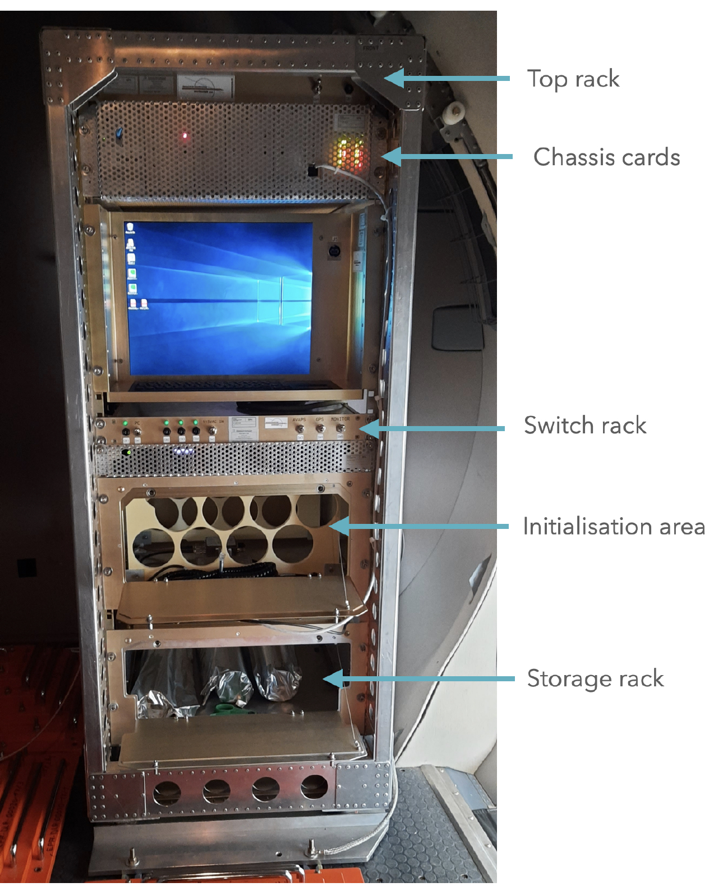
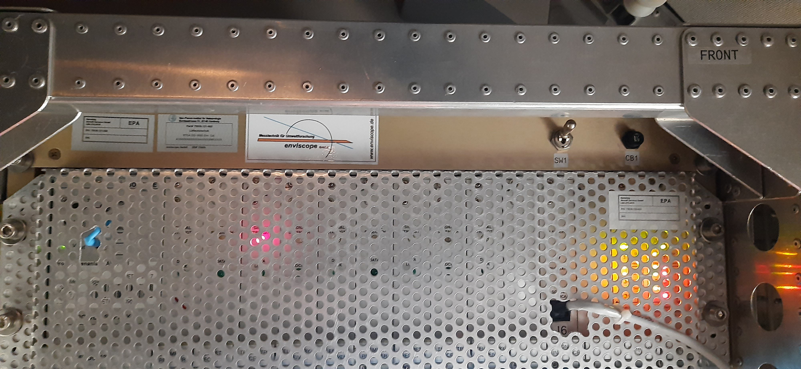
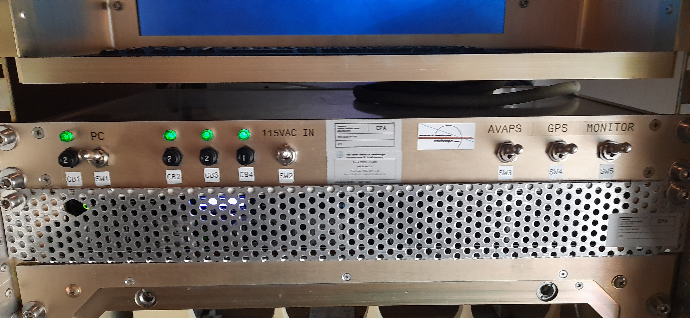
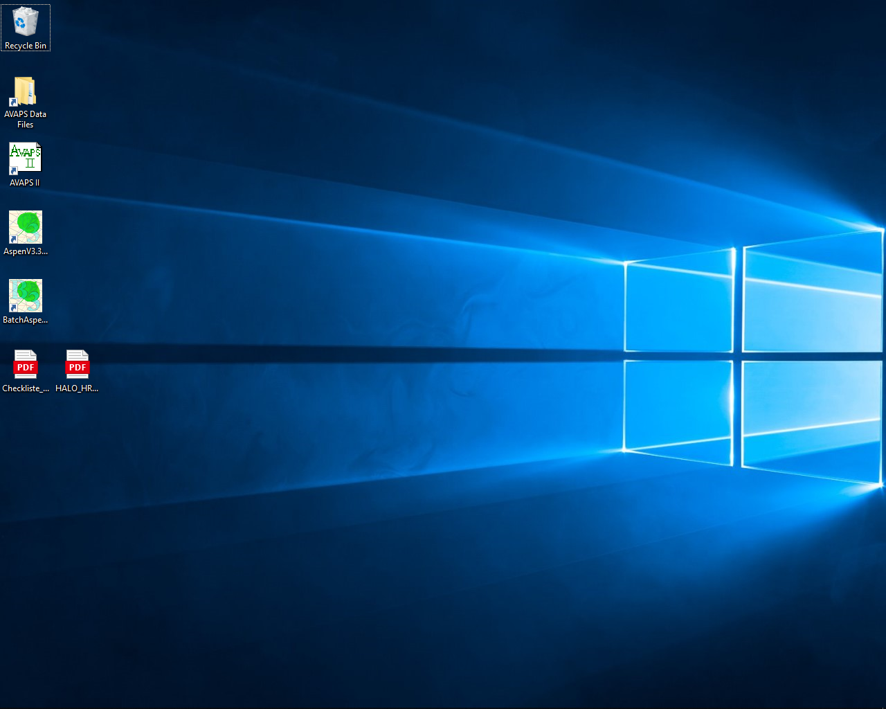
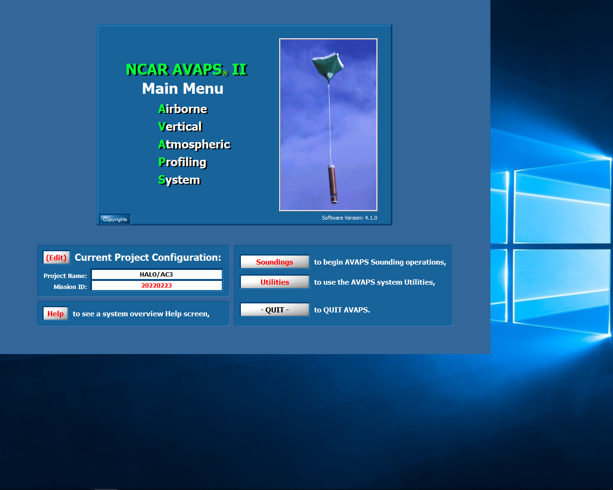

# Switching on AVAPS

The HRDS rack is situated in the baggage compartment at the back of the aircraft. It is shown and relevant areas are marked in the photograph below.

|  |
| :-------------------------------------------------------------: |
|    *HRDS Rack <small>(photo courtesy: Geet George)</small>*     |

1. Switch on the ventilating fans in the top rack by bringing the switch `SW1` (`Top rack`) to the `up` position. Photo below shows switch in the `on` position.

    |                 |
    | :-----------------------------------------------------: |
    | *Top rack <small>(photo courtesy: Geet George)</small>* |

2. Power on HRDS components in the `Switch rack` with switches `SW1`, `SW2`, `SW3`, `SW4` and `SW5` (in that order). Photo below shows all switches in the `on` position. The breakers (marked as `CB`) in both racks are not to be touched - they should be kept in their original positione, i.e. pressed in.

    |                                                                                                   |
    | :---------------------------------------------------------------------------------------------------------------------------------------------: |
    | *Switch rack. Labels above the switches indicate the respective components which are powered on.  <small>(photo courtesy: Geet George)</small>* |

3. Screen should look like the picture below after booting has completed.

    |  |
    | :----------------------------------------------: |
    |                  *Start screen*                  |

4. Start the `AVAPS II` software. You should find the shortcut icon on the Desktop. The software opens to look like this.

    |  |
    | :---------------------------------------------------: |
    |                 *AVAPS start screen*                  |
